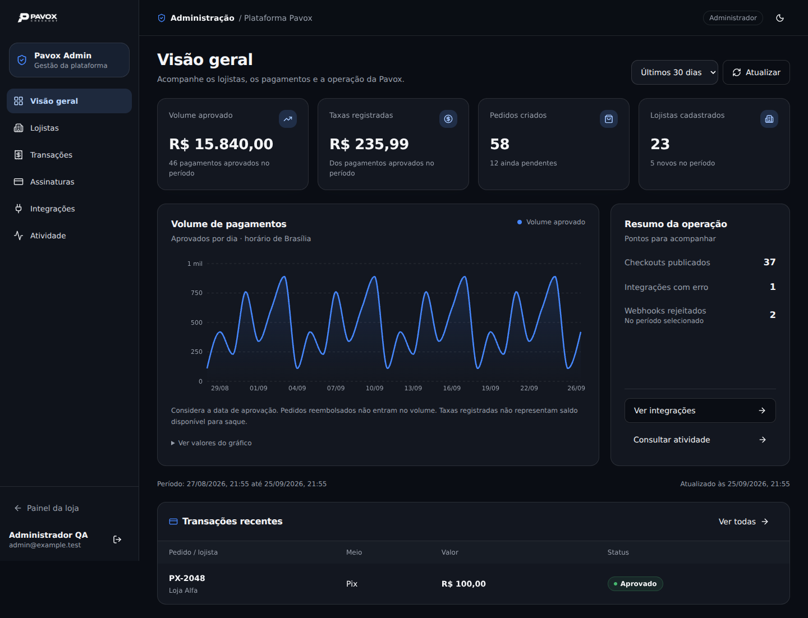

# Painel administrativo Pavox

A área `/admin` reúne visão geral, lojistas, transações, assinaturas, integrações e atividade da plataforma. Reutiliza o login, o tema claro/escuro, Sora/Manrope e os componentes existentes.

## Prévia

Captura da interface executada localmente, com dados fictícios usados somente nos testes de navegador. O código entregue consulta o Supabase; não inclui esses dados de exemplo.



## Ativação

1. Em um banco novo, aplique as migrações já existentes até `0015_order_emails_refunds.sql` e, em seguida, `drizzle/migrations/0016_platform_admin.sql`. A migração também está registrada no journal do Drizzle. No Supabase da Pavox (`cipiezekcudcvivtdnpr`), o conteúdo do admin **já foi aplicado** em 26/09/2026, como `20260926111521_pavox_platform_admin`; não o execute novamente nesse banco. O arquivo foi renumerado para acomodar as duas migrações que chegaram à branch principal.
2. No SQL Editor do Supabase, como proprietário do banco, conceda acesso a uma conta **já cadastrada**. Substitua o UUID abaixo pelo ID conferido em Authentication → Users:

```sql
insert into private.platform_admins (user_id, role)
values ('UUID_DA_CONTA_AUTORIZADA'::uuid, 'admin')
on conflict (user_id) do update set role = excluded.role;
```

3. Publique a branch aprovada pelo fluxo de deploy existente. Acesse `/admin` e entre com essa conta. O login administrativo retorna para `/admin`, mesmo quando a conta não tem assinatura de lojista. O menu do painel da loja também passa a mostrar “Administração” para contas autorizadas.

Use o papel `viewer` para consulta sem inclusão de notas. Para revogar:

```sql
delete from private.platform_admins
where user_id = 'UUID_DA_CONTA_AUTORIZADA'::uuid;
```

Nenhuma conta é promovida automaticamente. Papéis de equipe, metadados do cadastro e e-mail não concedem acesso de plataforma. A concessão inicial é feita somente no ambiente confiável do banco. Não é necessário adicionar chaves de serviço ao frontend.

## Funcionalidades

| Área | Comportamento |
| --- | --- |
| Visão geral | Volume aprovado, taxas registradas, pedidos criados, lojistas, série diária e resumo da operação; períodos de 7, 30 e 90 dias. |
| Lojistas | Busca, filtro por assinatura, paginação, detalhes, checkouts públicos e notas internas persistidas. |
| Transações | Busca por referência, UUID, cliente ou lojista; filtros de status/período; detalhes de valor, taxa, gateway e confirmação. |
| Assinaturas | Consulta de plano, mensalidade cadastrada, taxa e período de cada conta. |
| Integrações | Gateway, ambiente, status, meios habilitados e resultado/data do último teste registrado. |
| Atividade | Webhooks e trilha de inclusão de notas; filtros, busca e detalhes sem payload bruto. |
| Exportação | CSV dos 20 registros da página atual, com os filtros aplicados, escape de células e proteção contra fórmulas. |

As demais informações são de consulta. Esta entrega não adiciona alteração de planos, bloqueio de lojistas, reembolso, reprocessamento de webhook ou teste de credenciais de terceiros. A inclusão de notas é a ação de escrita disponível e registra o autor em auditoria na mesma transação.

## Critérios dos indicadores

- Volume e taxas consideram pedidos atualmente `Aprovado`, pela data `paid_at`, até o instante da consulta. Reembolsos, pendentes e recusados ficam fora.
- A contagem de pedidos e a listagem de transações usam `created_at`. Um pedido criado antes do período e aprovado dentro dele entra no volume, mas não na listagem daquele período.
- As taxas são as registradas nos pedidos; o painel não as apresenta como saldo disponível ou como confirmação de repasse.
- Série diária e início dos períodos usam `America/Sao_Paulo`. O total cadastrado de lojistas, checkouts publicados e integrações com erro considera o estado atual; novos lojistas e webhooks rejeitados consideram o período.
- Mensalidade e percentual na área de assinaturas refletem o plano cadastrado, sem presumir pagamento de uma cobrança.
- Buscas são literais, limitadas a 120 caracteres; paginação de 20 itens, com desempate por UUID. Detalhes mostram os 20 checkouts e as 50 notas mais recentes da loja.

## Controle de acesso

Cada RPC consulta `private.platform_admins` usando `auth.uid()`. As tabelas de papéis, notas e auditoria ficam no schema privado, com RLS e sem permissões diretas para `anon`/`authenticated`. Funções com acesso global têm `search_path` vazio e projeções explícitas. Não há acesso de plataforma por `user_metadata`.

As respostas excluem credenciais, referências ao Vault, documentos/endereço do comprador, dados de pagamento e payloads brutos de webhook. As políticas existentes dos lojistas são mantidas. As consultas React Query incluem a identidade na chave, não persistem cache administrativo sem consumidores e são revalidadas ao focar a janela. A revogação bloqueia a próxima consulta no banco.

Referência de implementação: [funções de banco do Supabase](https://supabase.com/docs/guides/database/functions).

## Validação

Os testes em `tests/platform-admin.sql` devem rodar em **banco de teste isolado e vazio**, após as migrações, como proprietário. Inserem fixtures temporárias e fazem rollback ao terminar:

```sh
psql "$PAVOX_TEST_DATABASE_URL" -v ON_ERROR_STOP=1 -f tests/platform-admin.sql
```

Cobrem acesso anônimo, conta comum, leitura, administração, revogação, isolamento dos lojistas, proteção contra autopromoção, métricas, datas, paginação, filtros, ocultação de segredos, notas persistidas e auditoria.

O teste local de banco usa PostgreSQL em PGlite, com interfaces de Auth, Storage e Vault substituídas apenas no ambiente de teste. As migrações do journal e as funções reais do painel são executadas. Isso não valida o login ou o deploy remoto.

Após publicar, valide o login com uma conta autorizada e outra sem permissão. No banco remoto, as cinco funções foram verificadas em 26/09/2026: acesso anônimo e de lojista bloqueado, leitura por viewer, notas e auditoria por admin, e bloqueio após revogação. O teste rodou em uma transação revertida, sem manter contas promovidas nem notas de teste. Em seguida, a conta indicada expressamente pelo responsável recebeu o papel administrativo definitivo; a operação foi registrada na auditoria, e as consultas de acesso e visão geral confirmaram a autorização.

A publicação na Vercel está pendente. O acesso do plugin à equipe `newman079051-8837s-projects` e ao projeto `render-duplicate-master` (`prj_AHhXWjZNNtpOyEocuMjZ5lmnqorx`) foi restabelecido em 26/09/2026. A ferramenta `deploy_to_vercel` continua retornando `Tool not found`. O build com `NITRO_PRESET=vercel npm run build` foi aprovado e gerou a saída da Vercel.

A alternativa com o Vercel CLI oficial (60.1.3) chegou à autorização pelo navegador, mas o ambiente de execução bloqueou o acesso a `https://api.vercel.com:443`; a política também recusou o pedido de elevação de permissões de rede. A autenticação do CLI não foi salva e nenhum deploy do admin foi criado. É necessário continuar em um ambiente com acesso de rede autorizado à API da Vercel. A versão atualmente publicada continua baseada no commit `6a455b0`, sem os arquivos do admin. A publicação direta pela CLI também não atualiza o GitHub; as alterações do pacote precisam ser incorporadas ao repositório para permanecerem nos próximos deploys automáticos.

O relatório de segurança foi consultado antes e depois da instalação. Os avisos adicionados correspondem às três tabelas privadas sem políticas (acesso direto negado intencionalmente) e às cinco funções administrativas chamadas por usuários autenticados (autorização conferida no corpo das funções). Os testes remotos confirmaram essas restrições. Referências: [RLS sem políticas](https://supabase.com/docs/guides/database/database-linter?lint=0008_rls_enabled_no_policy) e [funções privilegiadas autenticadas](https://supabase.com/docs/guides/database/database-linter?lint=0029_authenticated_security_definer_function_executable). Os avisos anteriores sobre endpoints públicos e proteção contra senhas vazadas não foram alterados por esta entrega.

### Resultado desta implementação

- Build de produção (`npm run build`): aprovado; build para Vercel também aprovado após integração da versão atual da branch principal.
- ESLint e Prettier dos arquivos novos do admin: aprovados.
- As 18 entradas do journal (0000–0016) e os testes SQL passaram no PostgreSQL local em PGlite após integração da branch principal; verificação das funções e permissões também aprovada no Supabase remoto em 26/09/2026.
- Navegador Chromium: seis áreas, detalhes, busca, filtros, paginação, CSV, inclusão de notas, estado vazio, falha/repetição de consulta e permissões visuais verificados com respostas de teste interceptadas. Esses testes de interface não substituem o teste SQL das permissões.
- Larguras de 390, 768 e 1440 px verificadas; navegação móvel e tabelas sem alargar a página. O defeito encontrado no posicionamento de um rótulo acessível da tabela foi corrigido.
- `tsc --noEmit`: cinco erros preexistentes, nos arquivos de landing `reveal.tsx` e `sections/pricing.tsx`, e em `_dash/equipe.tsx`. Nenhum desses arquivos foi modificado e não há erros de tipo nos arquivos adicionados para o admin.
